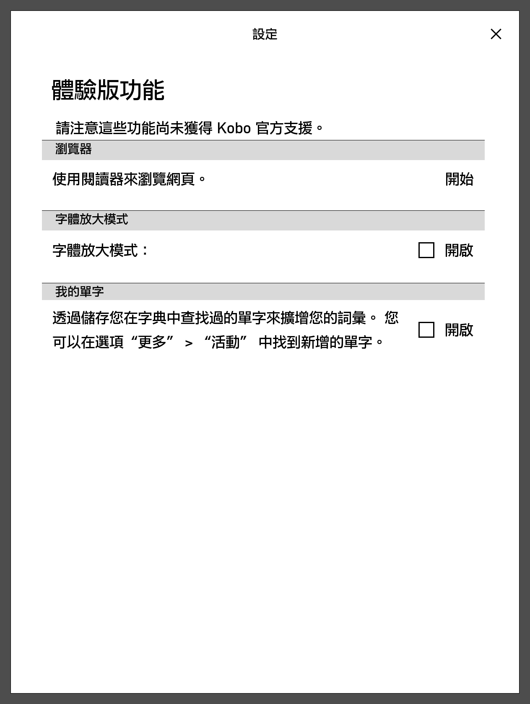
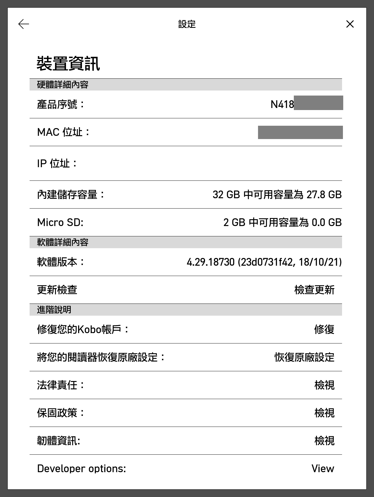

### 技巧

[加入字體](#加入字體) 
[休眠畫面](#休眠畫面) 
[回復原廠設置](#回復原廠設置) 
[修改閱讀器設定](#修改閱讀器設定) 
[開啟更多功能](#開啟更多功能) 

#### 加入字體
官方目前預設字體有下圖合共10種字體，但中文字體不多。 
可到[此網站](http://www.vixual.net/blog/archives/107)下載適合Kobo閱讀器的字體。 

1. 連接閱讀器至電腦，打開根目錄。 
2. 新增名為`Fonts`的資料夾。注意英文大細階。 
3. 放入字體檔後，退出閱讀器。 
^ 放入的字體只支援`TTF`及`SubsetOTF`，測試用字體為「懷源黑體 TW Medium」。 

4. 無須重啟閱讀器，返回書籍中，點選字體即可見新加入字體「KaiGen Gothic TW Medium」。 

#### 休眠畫面
1. 連接閱讀器至電腦，打開`.kobo`。 
2. 新增名為`Screensaver`的資料夾。 
3. 根據閱讀器畫面大小，放入適當的圖片。可`jpg`或`png`。 
4. 電腦退出閱讀器，點右下角「更多」。
5. 點「設定/省電及私隱權設定」，tick「顯示目前正在閱讀」及「顯示全螢幕書封」。 

6. 休眠或關機會顯示新增的圖片而非閱讀中的書。 

#### 回復原廠設置
普通重設
1. 先到主畫面，並點右下角「更多」。
2. 按「設定」後，選擇「裝置資訊」。
3. 最後按「恢復原廠設定」即可。

手動重設
1. 請先長按電源制直至關機
2. 根據裝置，選擇適用的手動重設方法。 | [官方指引](https://help.kobo.com/hc/zh-tw/articles/360017765713) 

#### 修改閱讀器設定
可以修改大部份裝置的隱藏設定。 
1. 到`.kobo`/`Kobo`。 
2. 用適當軟件打開`Kobo eReader.conf`，根據[此表](https://wiki.mobileread.com/wiki/Kobo_Configuration_Options)的說明輸入設定或修改原有設定。 
以下為較常用設定，可以加入： 

<table>
  <tr><th>Screenshots</th><th>Cap圖</th></tr>
  <tr><th>ExportHighlights</th><th>匯出重點</th></tr>
</table>

3. 完成後儲存。並重啟閱讀器。 

<b>^ 請注意，使用Window系統時，請勿使用系統記事本編輯，改用如Notepad++等軟件。 
如下圖示，開啟Notepad++的「檢視/特殊字元」的「顯示所有字元」，
正常行尾會顯示`LF`而非`CR` `LF`。 
請編輯後以「UNIX格式(LF)」儲存，否則修改將無法套用。</b> 

#### 開啟更多功能
1. 在主畫面，點右上方「搜尋」。 
2. 輸入並搜尋`devmodeon`。會出現「找不到任何結果」。 

3. 關閉「搜尋」後，打開右下角「更多」。 
4. 按「體驗版功能」後，可見更多功能出現(下方右圖)，包括數獨等。 

 

<blockquote>
 4a. 按「設定」中的「裝置資訊」，可見下方有`Developer Options`出現，可修改更多功能。 
  
</blockquote>
^ 欲關閉更多體驗版功能，跟隨上述步驟但改為輸入`devmodeoff`即可。 
