### 推薦程式或插件
^ 請自行評估風險後再考慮是否安裝有關程式。

第三方閱讀程式 
- [Plato](https://github.com/baskerville/plato) |  [教學](#Plato)
- [KOReader](https://github.com/koreader/koreader)

轉檔至Kobo epub 
- [kepubify](https://github.com/pgaskin/kepubify) | [教學](#kepubify)
- 手動修改檔名 | [教學](#手動修改檔名)

匯入雲端書籍 
- [KoboCloud](https://github.com/fsantini/KoboCloud) | [教學](#KoboCloud)

瀏覽器插件 
Google Chrome
- [Kobo 電子書敗家幫手](https://chrome.google.com/webstore/detail/kobo-%E9%9B%BB%E5%AD%90%E6%9B%B8%E6%95%97%E5%AE%B6%E5%B9%AB%E6%89%8B/ggbmfiledfmoeinemnnappkjldilblfh?hl=zh-TW) | [教學](#Kobo電子書敗家幫手)

#### Plato

1. 請先到[Releases](https://github.com/baskerville/plato/releases)檢查更新後再到[論壇](https://www.mobileread.com/forums/showthread.php?t=314220)下載最新版本的Plato One-Click安裝檔`OCP-Plato-0.X.XX.zip`及Install script。 
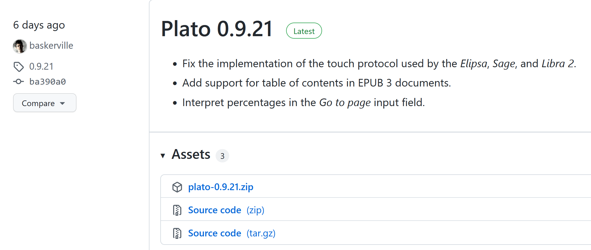 
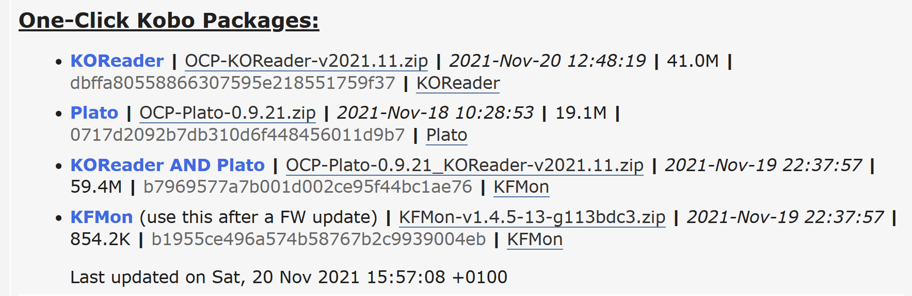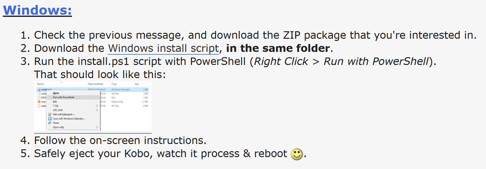 
2. 然後將兩個檔案放在`.kobo`資料夾內，無須解壓縮。 
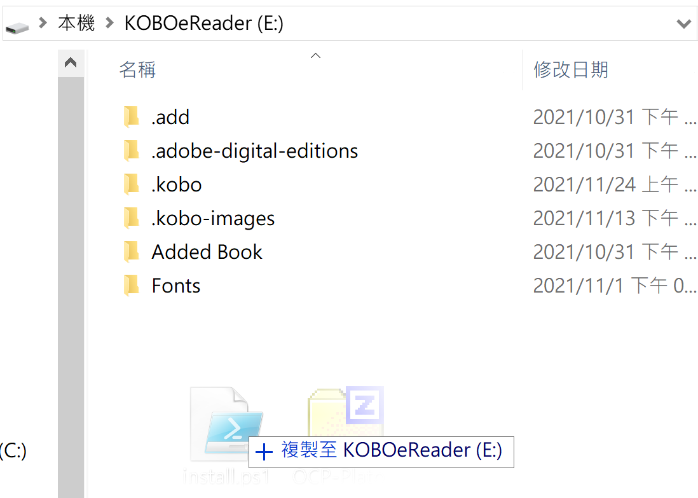 
3. 在Install script上右擊選擇「用PowerShell執行」。等候安裝完成即可。 
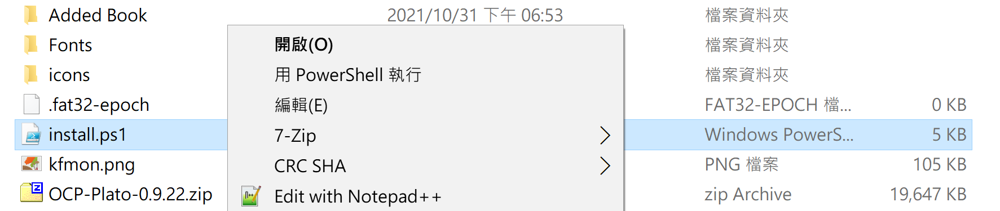 
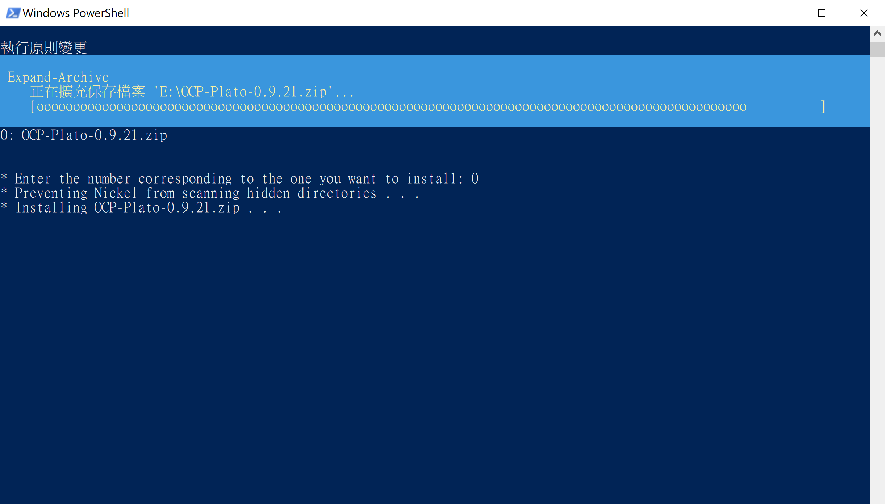 

^ 如使用Install script安裝，則無須再開啟`.kobo`/`Kobo`/`Kobo eReader.conf`並在`Kobo eReader.conf`中填入以下字句。手動解壓`OCP-Plato-0.X.XX.zip`的則需要填入。 
 
<blockquote>
[FeatureSettings] 
ExcludeSyncFolders=(\\.(?!kobo|adobe).+|([^.][^/]*/)+\\..+) 
</blockquote>

4. 以下為安裝後新增的資料夾。打開`.adds`/`plato`並重新命名`Settings-sample.toml`至`Settings.toml`。 
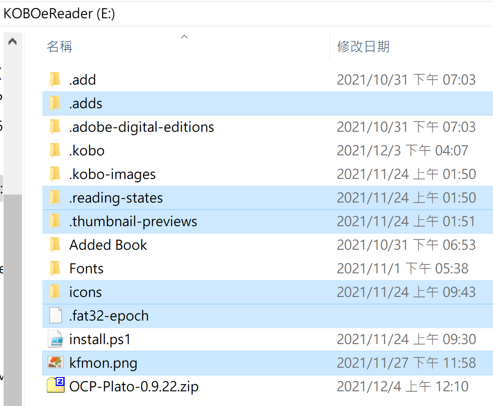 
5. 退出閱讀器，待重啟後即可使用。 

^ 如需更新，下載最新檔後按照上述步驟1至3重做即可。 

Plato系統實際畫面如下： 
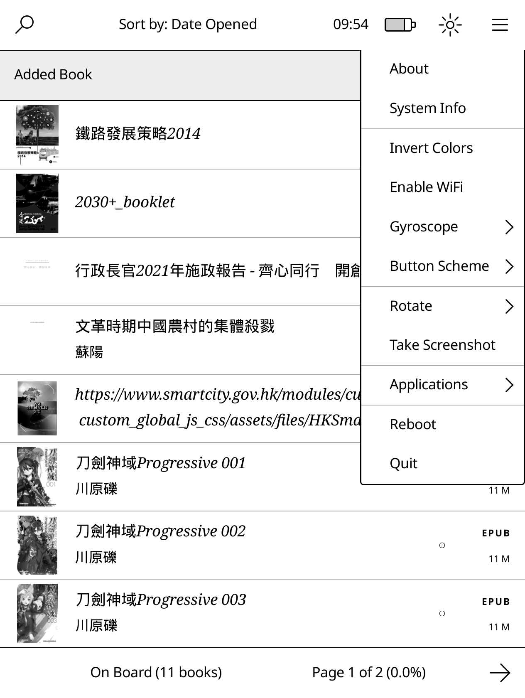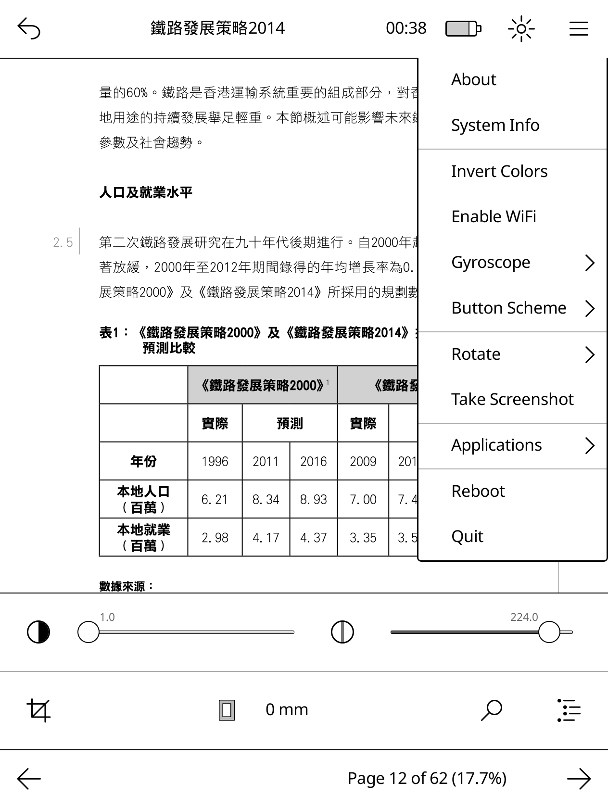 

#### kepubify
使用kobo epub形式的書籍，載入速度或比普通epub檔案更快及匯入的epub漫畫可橫向跨頁顯示，故建議將epub轉為kobo epub。 
^ kepubify亦有提供Web轉檔功能，詳細可到官網查看。 
1. 請先到[Release](https://github.com/pgaskin/kepubify/releases)或[官網](https://pgaskin.net/kepubify/dl/)下載最新版本的`kepubify`。 
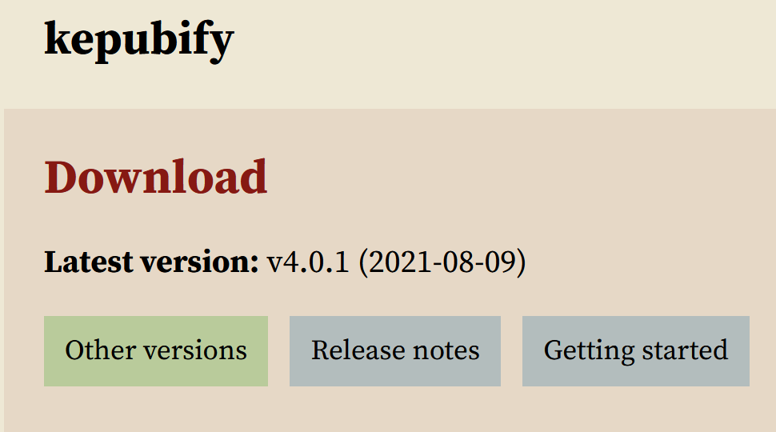 
2. 將想要轉換的epub檔拖到kepubify程式，等候轉換。 
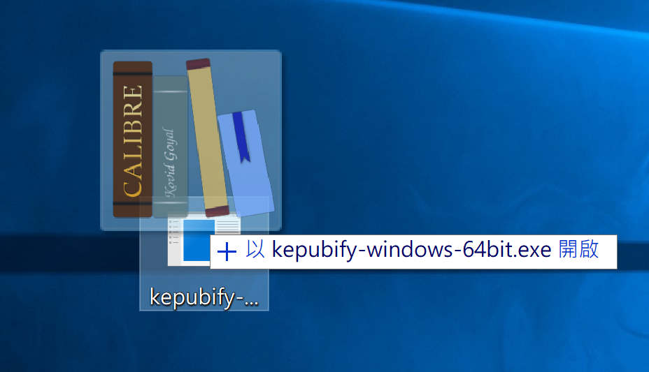 
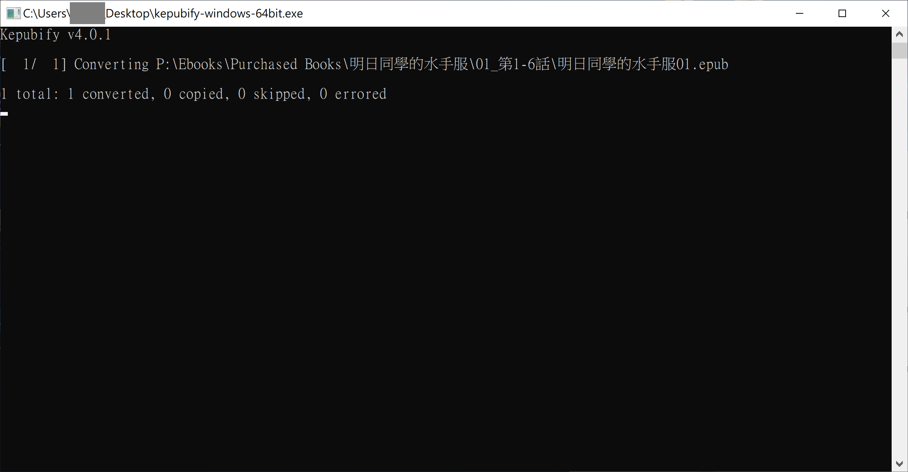 
3. 轉換的檔案會以`原檔名_converted.kepub.epub`命名，除`.kepub.epub`的部份，其餘的均可修改。 
4. 匯入到閱讀器，有關書籍會以`KOBO EPUB`檔案顯示及開啟。 
 
 
如上圖，轉檔後會改以KOBO EPUB形式開啟，而漫畫亦可橫向跨頁顯示。 

#### 手動修改檔名
無須下載軟件，適合少量轉檔。 
1. 將要修改的epub書籍`原檔名.epub`，重新命名為`原檔名.kepub.epub`即可。 

#### KoboCloud
1. 請先到[Release](https://github.com/fsantini/KoboCloud/releases)下載最新版本的`KoboRoot.tgz`。 
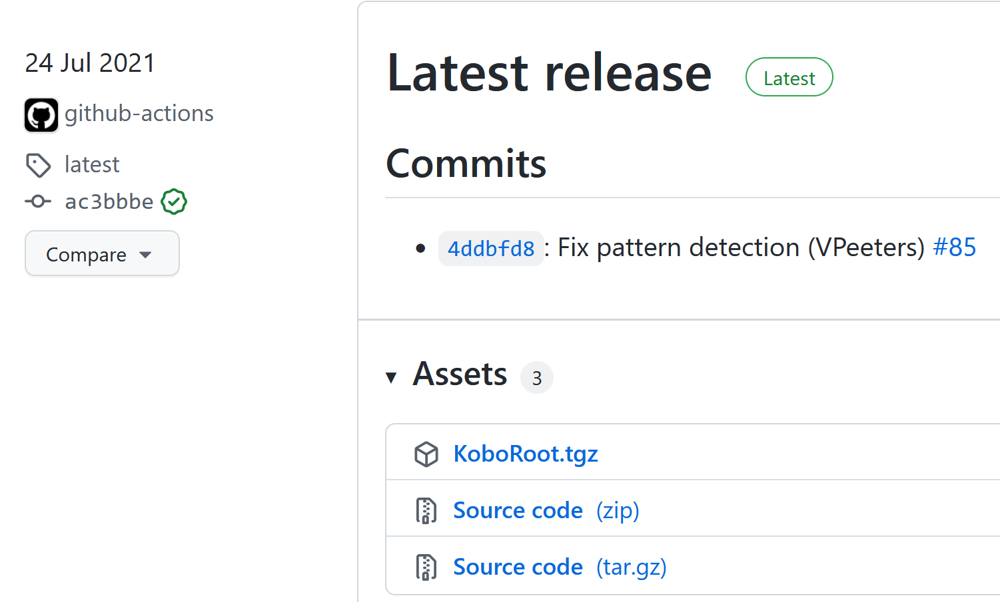 
2. 連接閱讀器到電腦。 
3. 將`KoboRoot.tgz`放在`.kobo`資料夾內，然後於電腦退出閱讀器。 
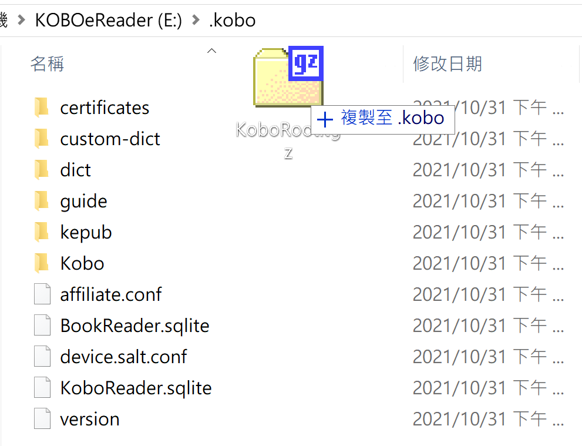 
4. 閱讀器會顯示「更新中」並重啟，待重啟後，再次連接閱讀器至電腦。 
5. 連接後，會出現`.add`資料夾，用記事本打開`.add`/`kobocloud`的`kobocloudrc`。 
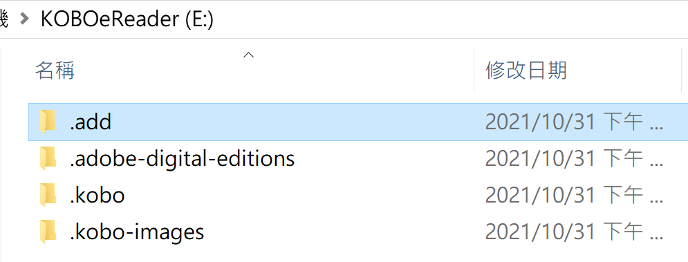 
6. 參考[指引](https://github.com/fsantini/KoboCloud#configuration)，加入雲端硬碟的連結到檔案內，儲存後關閉，退出閱讀器。 
^ 建議重啟閱讀器以確保文件能夠被讀取。 
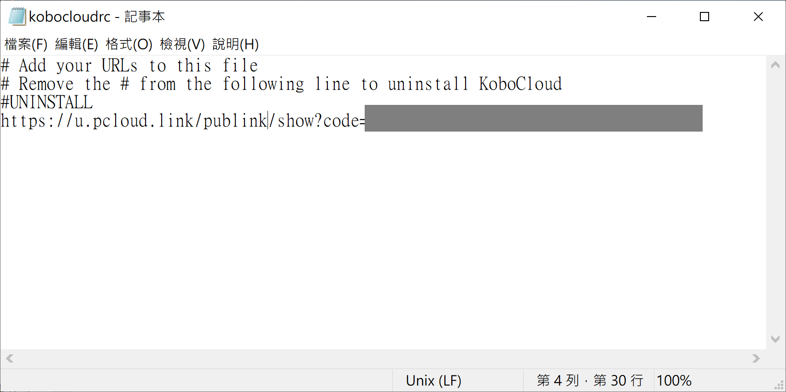 
7. 放入書籍到該雲端硬碟後，閱讀器連接wifi，等候書籍下載到閱讀器。 
^ 首次使用時需要耐心等候(約兩至三分鐘)，所需時間亦會因檔案大小和網速而有差別。 
^ 從KoboCloud匯入的書籍會在`.add`/`kobocloud`/`Library`內。雲端上的書籍在匯入後不會自動移除，請自行刪除。 

#### Kobo電子書敗家幫手
第三方插件，方便加入整個系列的書入購物車。 
1. 到Google Chrome線上應用程式商店安裝[插件](https://chrome.google.com/webstore/detail/kobo-%E9%9B%BB%E5%AD%90%E6%9B%B8%E6%95%97%E5%AE%B6%E5%B9%AB%E6%89%8B/ggbmfiledfmoeinemnnappkjldilblfh?hl=zh-TW)。 
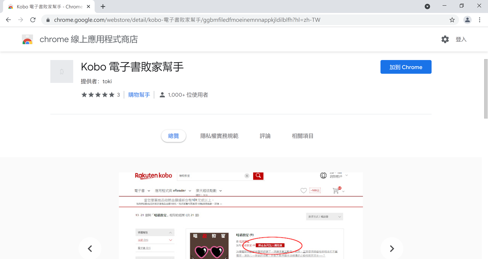 
2. 到Kobo網頁搜尋欲購買的書籍，在系列旁會顯示`將全系列加入購物車`。 
 
3. 點擊後，會自動將全系列書籍加到購物車。待完成後請重新整理網頁。 
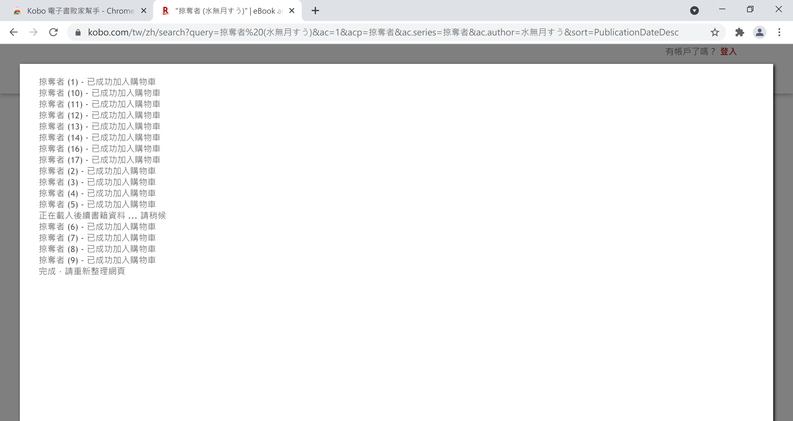 
4. 有關系列書籍應已加入到購物車內。 
 
^ 已購買書籍雖會一併加入到購物車，但結帳時Kobo會自動移除帳戶已擁有的書籍，不必手動移除。 
