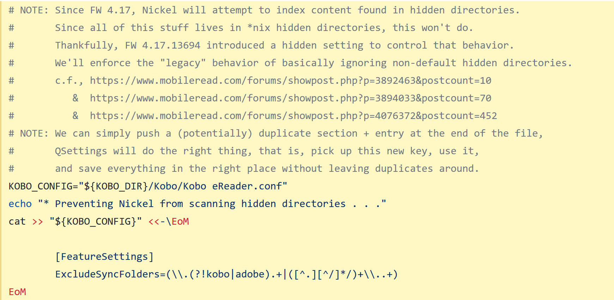
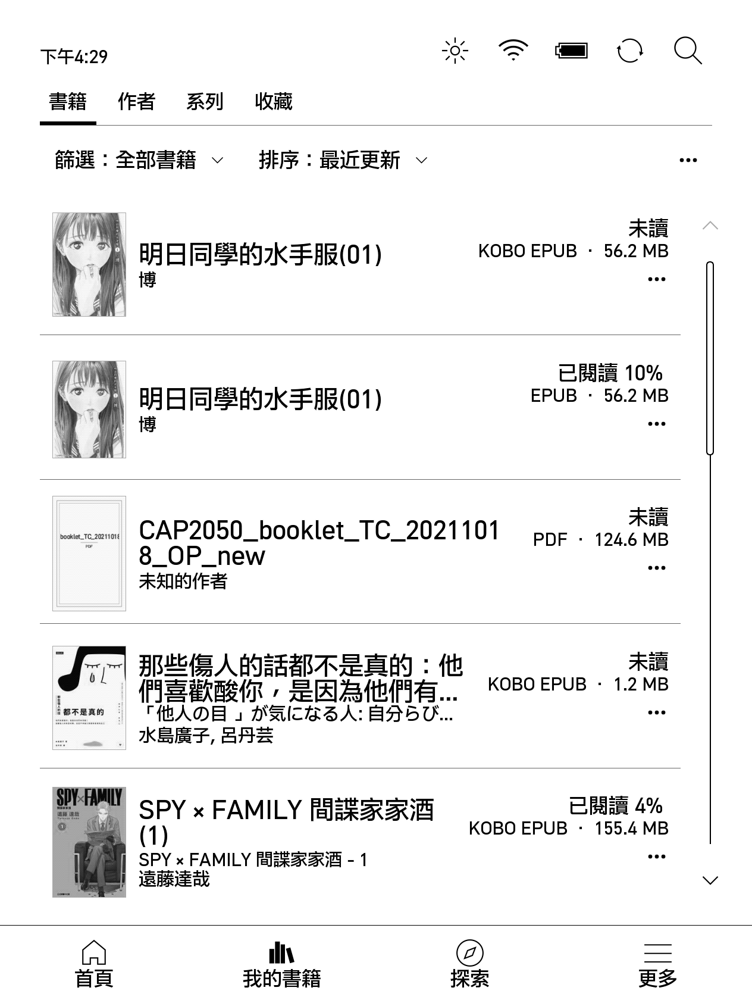
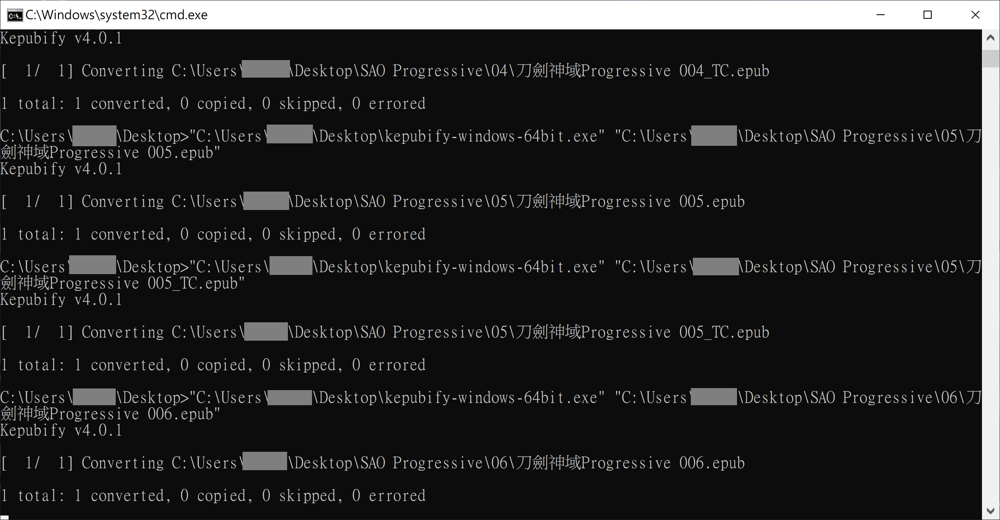
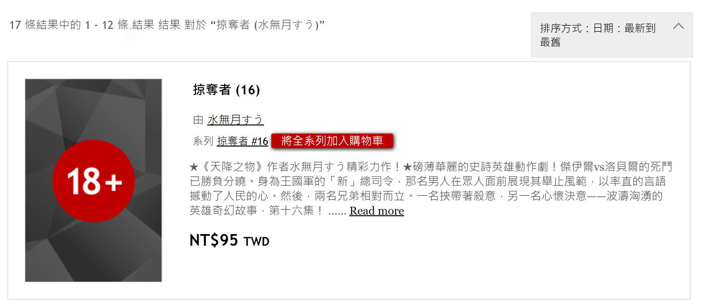
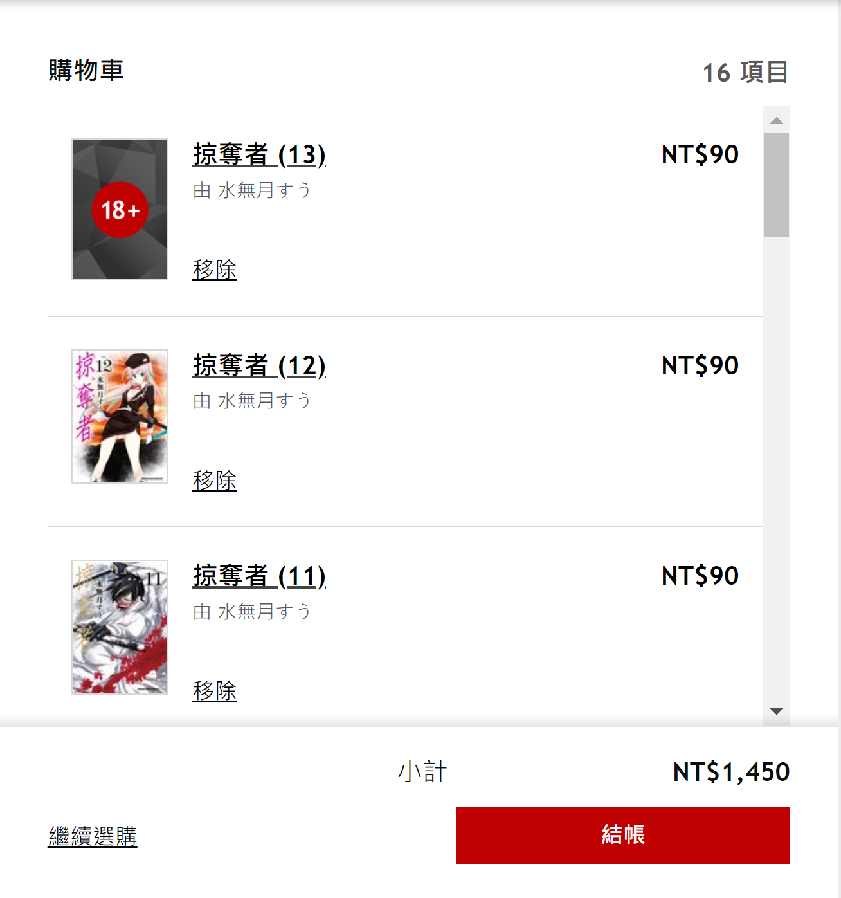

### 推薦程式或插件
^ 請自行評估風險後再考慮是否安裝有關程式。

第三方閱讀程式 
- [Plato](https://github.com/baskerville/plato) | [教學](#Plato)
- [KOReader](https://github.com/koreader/koreader) | [教學](#KOReader)
- [比較Plato及KOReader](#比較Plato及KOReader)

Kobo Firmware / Patch 
- [kobopatch](https://github.com/pgaskin/kobopatch) | [教學](#kobopatch)
- [Kobo Firmware Downloads](https://pgaskin.net/KoboStuff/kobofirmware.html)  | [教學](#kobo-firmware-downloads)

轉檔至Kobo epub 
- [kepubify](https://github.com/pgaskin/kepubify) | [教學](#kepubify)
- 手動修改檔名 | [教學](#手動修改檔名)

匯入雲端書籍 
- [KoboCloud](https://github.com/fsantini/KoboCloud) | [教學](#KoboCloud)

瀏覽器插件 
Google Chrome
- [Kobo 電子書敗家幫手](https://chrome.google.com/webstore/detail/kobo-%E9%9B%BB%E5%AD%90%E6%9B%B8%E6%95%97%E5%AE%B6%E5%B9%AB%E6%89%8B/ggbmfiledfmoeinemnnappkjldilblfh?hl=zh-TW) | [教學](#Kobo電子書敗家幫手)

#### Plato
1. 請先到[Releases](https://github.com/baskerville/plato/releases)檢查更新後再到[論壇](https://www.mobileread.com/forums/showthread.php?t=314220)下載最新版本的Plato One-Click安裝檔`OCP-Plato-0.X.XX.zip`及Install script。 
 
 
2. 然後將兩個檔案放在`.kobo`資料夾內，無須解壓縮。 
 
3. 在Install script上右擊選擇「用PowerShell執行」。等候安裝完成即可。 
 
 

^ 如使用Install script安裝，則無須再開啟`.kobo`/`Kobo`/`Kobo eReader.conf`並在`Kobo eReader.conf`中填入以下字句。手動解壓`OCP-Plato-0.X.XX.zip`的則需要填入。 
 
<blockquote>
[FeatureSettings] 
ExcludeSyncFolders=(\\.(?!kobo|adobe).+|([^.][^/]*/)+\\..+) 
</blockquote>

4. 以下為安裝後新增的資料夾。打開`.adds`/`plato`並重新命名`Settings-sample.toml`至`Settings.toml`。 
 
5. 退出閱讀器，待重啟後即可使用。 

^ 如需更新，下載最新檔後按照上述步驟1至3重做即可。 

Plato系統實際畫面如下： 
  

#### KOReader
1. 請先到[Releases](https://github.com/koreader/koreader/releases)檢查更新後再到[論壇](https://www.mobileread.com/forums/showthread.php?t=314220)下載最新版本的KOReader One-Click安裝檔`OCP-KOReader-v202X.XX.zip`及Install script。 
 
 
2. 然後將兩個檔案放在`.kobo`資料夾內，無須解壓縮。 
 
3. 在Install script上右擊選擇「用PowerShell執行」。等候安裝完成即可。 
 

^ 如使用Install script安裝，則無須再開啟`.kobo`/`Kobo`/`Kobo eReader.conf`並在`Kobo eReader.conf`中填入以下字句。手動解壓`OCP-KOReader-v202X.XX.zip`的則需要填入。 
 
<blockquote>
[FeatureSettings] 
ExcludeSyncFolders=(\\.(?!kobo|adobe).+|([^.][^/]*/)+\\..+) 
</blockquote>

4. 以下為安裝後新增的資料夾。退出閱讀器，待重啟後即可使用。 
 

^ 如需更新，請在KOReader內按「Update」即可。 
 

KOReader系統實際畫面如下： 
  
  

#### 比較Plato及KOReader
** 純粹個人意見，每人體驗或有所不同。 
<table>
  <tr>
   <td>Plato</td>
   <td>KOReader</td>
  </tr>
  <tr>
   <td>介面較簡潔，較多功能用圖案代替文字，或較難理解。 裁剪pdf白邊方面，只有手動裁剪。若裁錯範圍則無法重設。 耗電量較低。 需要連接電腦及下載更新檔後重新安裝。 顯示書籍列表方式和原生系統大同小異，沒有資料夾功能。若有過多書藉將較難尋找。</td>
   <td>介面較繁複，但功能更為全面。 裁剪pdf白邊方面，有自動裁剪等選項。若裁錯範圍亦可重設。 耗電量較高。 可直接在閱讀器內進行更新。 顯示書籍列表方式較接近電腦，按照匯入時的結構顯示，大量書籍亦容易整理。</td>
  </tr>
</table>

#### kobopatch
可新增對字型、行距、邊界、顯示書籍資料等的修改。 
* 請先到「裝置資訊」確認Firmware版本與kobopatch是否一致。<b>切勿安裝與裝置Firmware版本不同的kobopatch。</b> 
1. 到[Releases](https://github.com/pgaskin/kobopatch-patches/releases/latest)下載最新的kobopatch。然後再到[網頁](https://pgaskin.net/KoboStuff/kobofirmware.html)下載適用型號的對應Firmware檔。 
2. 解壓縮`kobopatch_4.XX.XXXXX.zip`，然後將Firmware檔放至`src`資料夾內。 
 
3. 打開`src`，再以記事本打開入面的`.yaml`檔，將裏面需要使用的項目`Enabled`改為`yes`。 
^ 圖中修改`Enable advanced settings for all fonts`，可令英文以外的字體使用進階設定。 
 
4. 打開`kobopatch.bat`，等候完成。 
 
5. 打開`out`資料夾，將剛製作完成的`KoboRoot.tgz`放到`.kobo`資料夾內。 
6. 退出閱讀器後待更新完成即可。 
 

#### Kobo Firmware Downloads
如Kobo閱讀器無法正常更新，可考慮自行下載檔案進行更新。 
1. 到此[網頁](https://pgaskin.net/KoboStuff/kobofirmware.html)下載適用型號的Firmware檔。 
 
2. 然後將下載zip檔解壓至`.kobo`資料夾內。 
3. 退出閱讀器後待更新完成即可。 

#### kepubify
使用kobo epub形式的書籍，載入速度或比普通epub檔案更快及匯入的epub漫畫可橫向跨頁顯示，故建議將epub轉為kobo epub。 
^ kepubify亦有提供Web轉檔功能，詳細可到官網查看。 
1. 請先到[Release](https://github.com/pgaskin/kepubify/releases)或[官網](https://pgaskin.net/kepubify/dl/)下載最新版本的`kepubify`。 
 
2. 將想要轉換的epub檔拖到kepubify程式，等候轉換。 
 
 
3. 轉換的檔案會以`原檔名_converted.kepub.epub`命名，除`.kepub.epub`的部份，其餘的均可修改。 
4. 匯入到閱讀器，有關書籍會以`KOBO EPUB`檔案顯示及開啟。 
 
 
如上圖，轉檔後會改以KOBO EPUB形式開啟，而漫畫亦可橫向跨頁顯示。 

<blockquote>
如需要大量轉換，可利用bat進行。 
1. 複製要轉換的epub檔及kepubify完整路徑。 
2. 開啟記事本，每行均按以下格式輸入。每行為一個檔案。 
"kepubify完整路徑" "轉換的一個epub檔完整路徑" 

`"C:\Users\Megumi_B\Desktop\kepubify-windows-64bit.exe" "C:\Users\Megumi_B\Desktop\Added Book\刀劍神域Progressive\刀劍神域Progressive 001_TC.epub"` 
3. 儲存檔案為`.bat`，然後執行。 
4. 等候轉換完成即可。 

</blockquote>

#### 手動修改檔名
無須下載軟件，適合少量轉檔。 
1. 將要修改的epub書籍`原檔名.epub`，重新命名為`原檔名.kepub.epub`即可。 

#### KoboCloud
1. 請先到[Release](https://github.com/fsantini/KoboCloud/releases)下載最新版本的`KoboRoot.tgz`。 
 
2. 連接閱讀器到電腦。 
3. 將`KoboRoot.tgz`放在`.kobo`資料夾內，然後於電腦退出閱讀器。 
 
4. 閱讀器會顯示「更新中」並重啟，待重啟後，再次連接閱讀器至電腦。 
5. 連接後，會出現`.add`資料夾，用記事本打開`.add`/`kobocloud`的`kobocloudrc`。 
 
6. 參考[指引](https://github.com/fsantini/KoboCloud#configuration)，加入雲端硬碟的連結到檔案內，儲存後關閉，退出閱讀器。 
^ 建議重啟閱讀器以確保文件能夠被讀取。 
 
7. 放入書籍到該雲端硬碟後，閱讀器連接wifi，等候書籍下載到閱讀器。 
^ 首次使用時需要耐心等候(約兩至三分鐘)，所需時間亦會因檔案大小和網速而有差別。 
^ 從KoboCloud匯入的書籍會在`.add`/`kobocloud`/`Library`內。雲端上的書籍在匯入後不會自動移除，請自行刪除。 

#### Kobo電子書敗家幫手
第三方插件，方便加入整個系列的書入購物車。 
1. 到Google Chrome線上應用程式商店安裝[插件](https://chrome.google.com/webstore/detail/kobo-%E9%9B%BB%E5%AD%90%E6%9B%B8%E6%95%97%E5%AE%B6%E5%B9%AB%E6%89%8B/ggbmfiledfmoeinemnnappkjldilblfh?hl=zh-TW)。 
 
2. 到Kobo網頁搜尋欲購買的書籍，在系列旁會顯示`將全系列加入購物車`。 
 
3. 點擊後，會自動將全系列書籍加到購物車。待完成後請重新整理網頁。 
 
4. 有關系列書籍應已加入到購物車內。 
 
^ 已購買書籍雖會一併加入到購物車，但結帳時Kobo會自動移除帳戶已擁有的書籍，不必手動移除。 
